# Basic CI/CD

<br>

## Part 1. Настройка **gitlab-runner**

### Подними виртуальную машину **Ubuntu Server 22.04 LTS.**

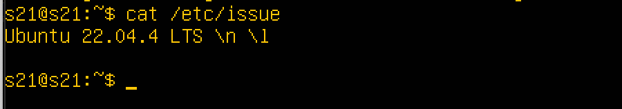

### Скачай и установи на виртуальную машину **gitlab-runner.**

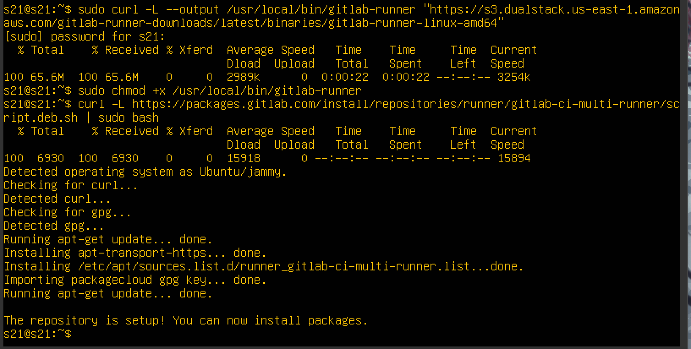

### Запусти **gitlab-runner** и зарегистрируй его для использования в текущем проекте (DO6_CICD).

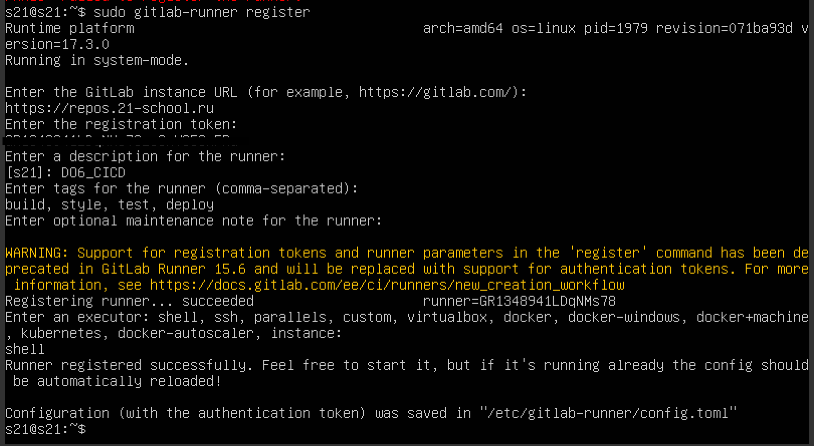

## Part 2. Сборка
 <br>

### Напиши этап для CI по сборке приложений из проекта **C2_SimpleBashUtils.**

В файле gitlab-ci.yml добавь этап запуска сборки через мейк файл из проекта C2.

Файлы, полученные после сборки (артефакты), сохрани в произвольную директорию со сроком хранения 30 дней.

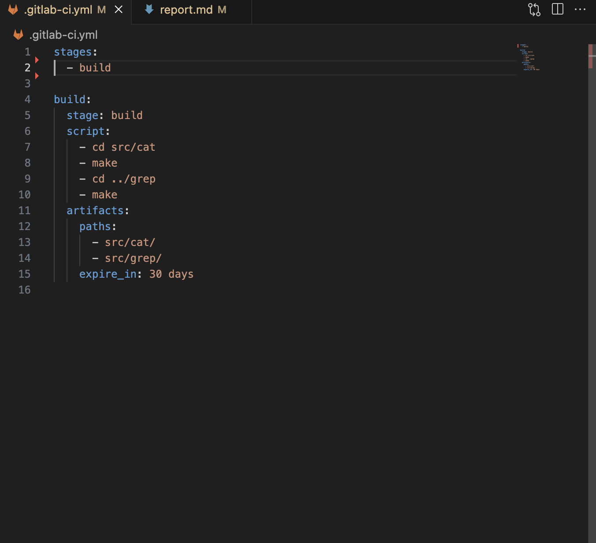

Проверил пайплайн, что все прошло успешно 

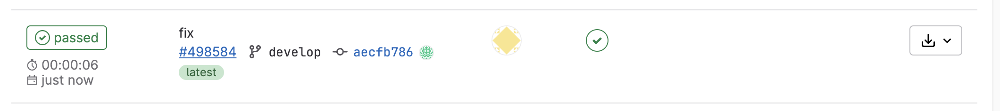

## Part 3. Тест кодстайла
<br>

### Напиши этап для CI, который запускает скрипт кодстайла (clang-format).

Если кодстайл не прошел, то «зафейли» пайплайн.

В пайплайне отобрази вывод утилиты clang-format.

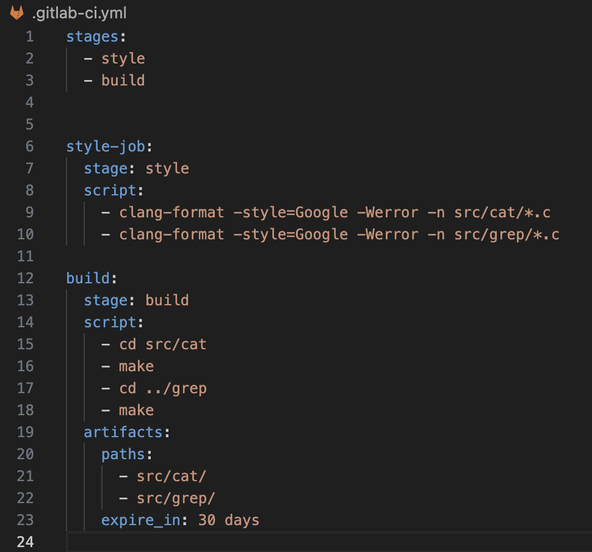

- Вывод когда clang-format **не прошел**

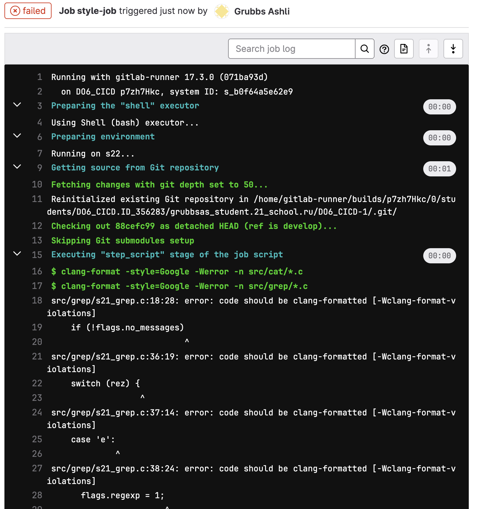
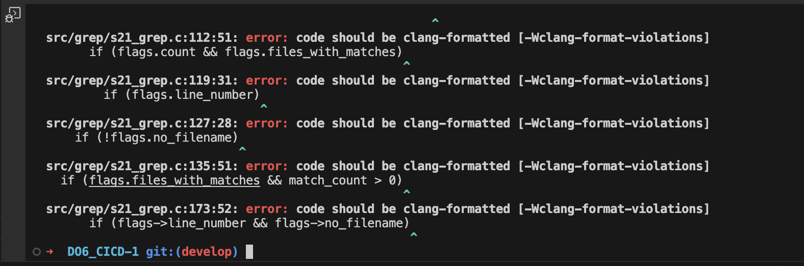

- Вывод когда clang-format **прошел** 

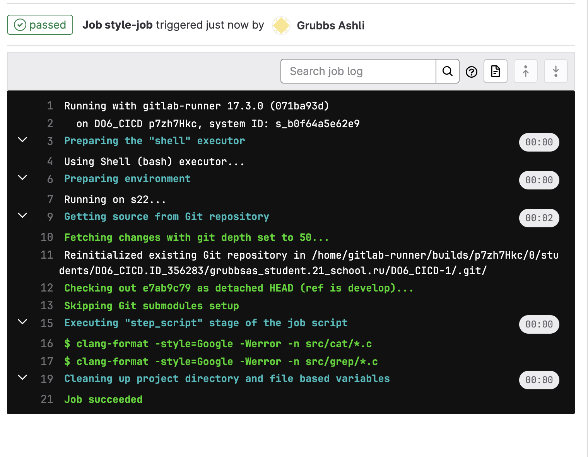


## Part 4. Интеграционные тесты

<br>

### Напиши этап для CI, который запускает твои интеграционные тесты из того же проекта.

Запусти этот этап автоматически только при условии, если сборка и тест кодстайла прошли успешно.

Если тесты не прошли, то «зафейли» пайплайн.

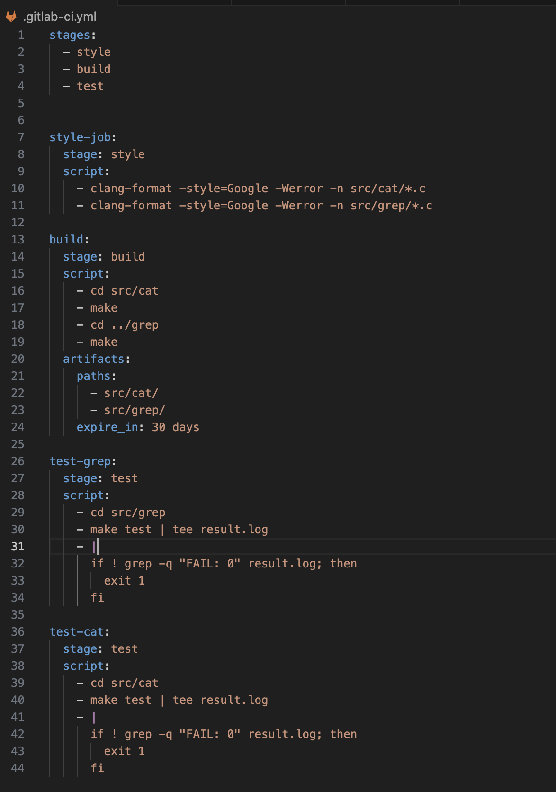

 - Вывод когда **не прошли** тесты , пайплайн показывает что, что то не так

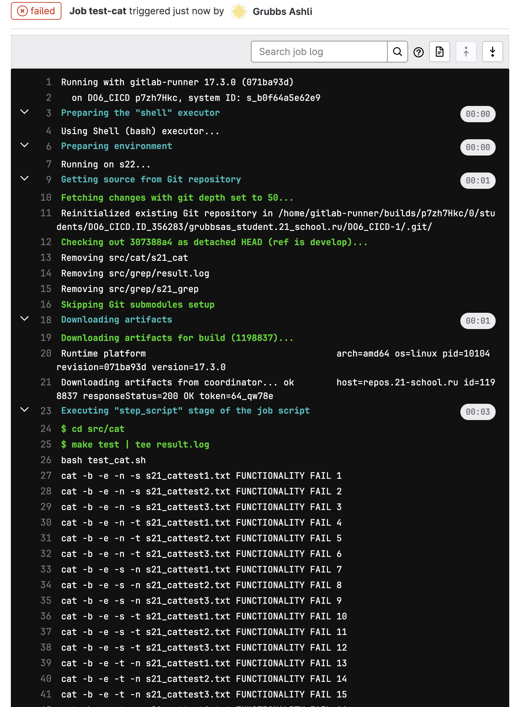

 - Вывод когда  **прошли** тесты , пайплайн показывает что все хорошо 

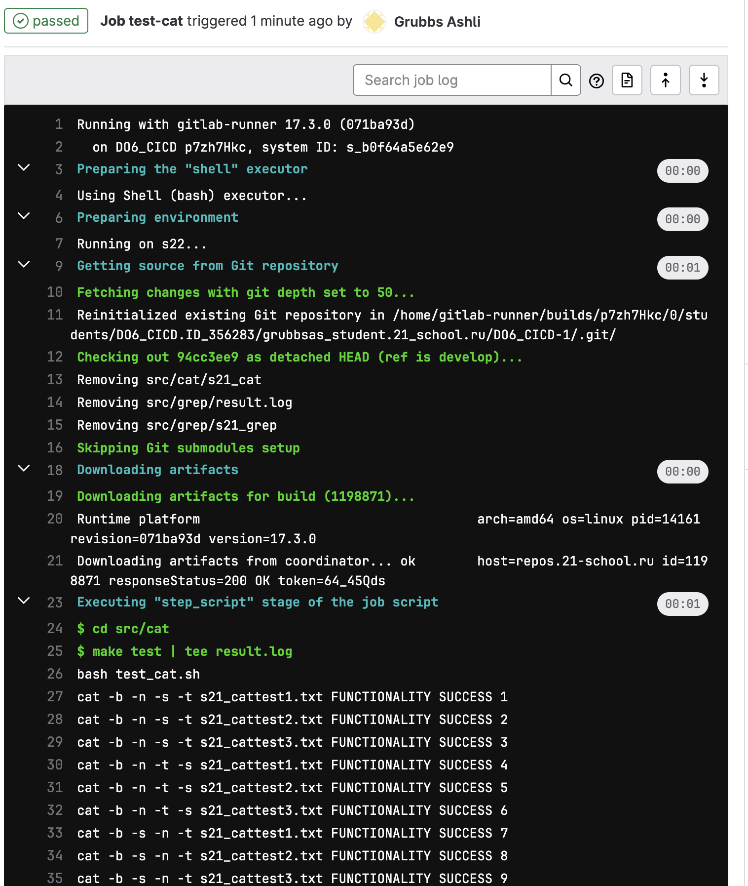

## Part 5. Этап деплоя

Подними вторую виртуальную машину **Ubuntu Server 22.04 LTS.**

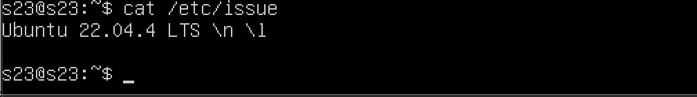

###  Напиши этап для CD, который «разворачивает» проект на другой виртуальной машине.

Запусти этот этап вручную при условии, что все предыдущие этапы прошли успешно.

C помочью команд ниже соединил 2 ВМ через ssh ключ 
```sh
sudo su gitlab-runner 

ssh-keygen -t rsa -b 2048

ssh-copy-id s23@10.100.0.11
```

Напиши bash-скрипт, который при помощи ssh и scp копирует файлы, полученные после сборки (артефакты), в директорию /usr/local/bin второй виртуальной машины.

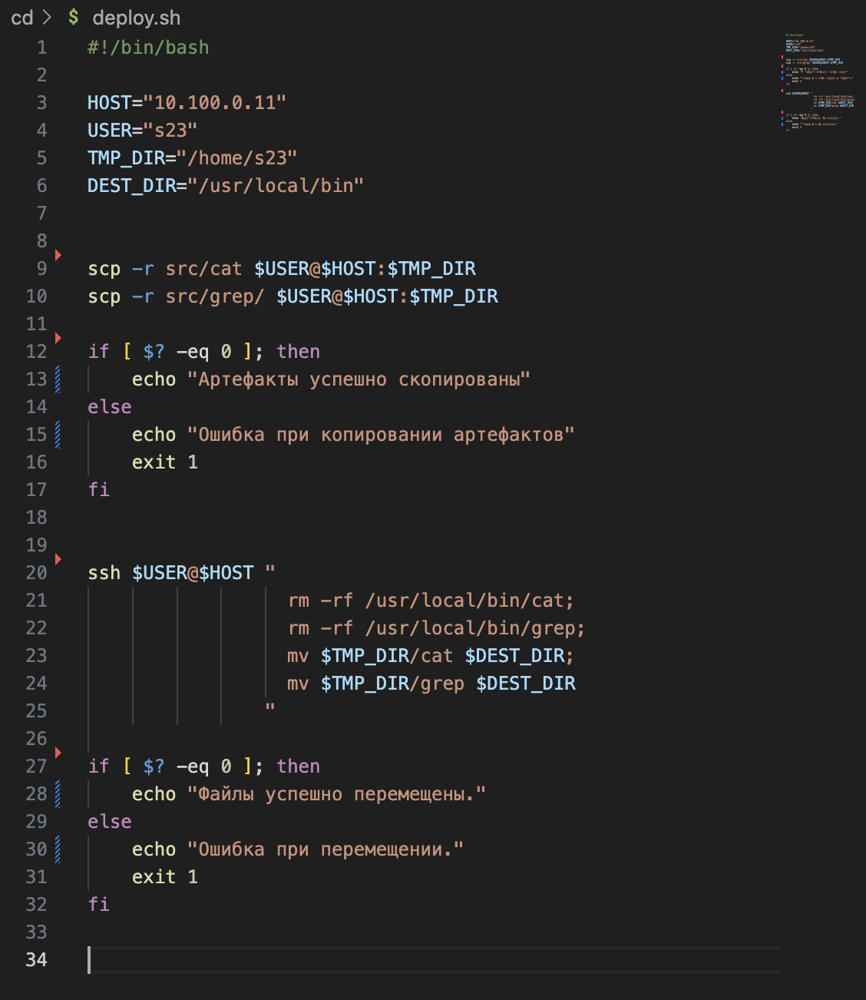

В файле gitlab-ci.yml добавь этап запуска написанного скрипта.

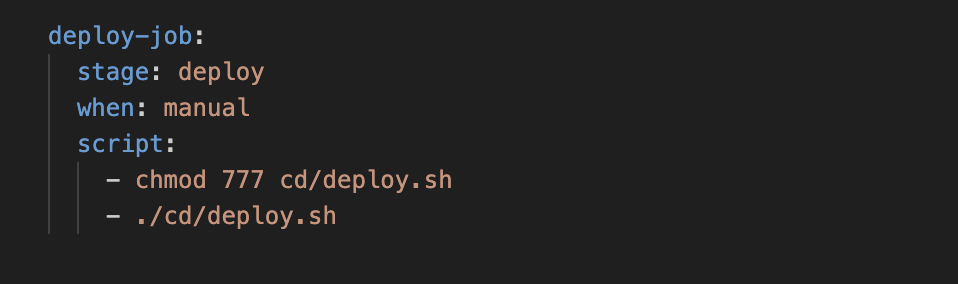